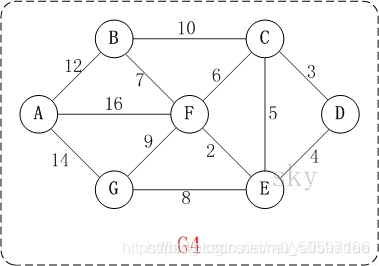

# 贪心算法

### 贪心算法思想：

顾名思义，贪心算法总是作出在当前看来最好的选择。也就是说贪心算法并不从整体最优考虑，它所作出的选择只是在某种意义上的局部最优选择。当然，希望贪心算法得到的最终结果也是整体最优的。虽然贪心算法不能对所有问题都得到整体最优解，但对许多问题它能产生整体最优解。如单源最短路经问题，最小生成树问题等。在一些情况下，即使贪心算法不能得到整体最优解，其最终结果却是最优解的很好近似。

### 贪心算法的基本要素：

1.贪心选择性质。所谓贪心选择性质是指所求问题的整体最优解可以通过一系列局部最优的选择，即贪心选择来达到。这是贪心算法可行的第一个基本要素，也是贪心算法与动态规划算法的主要区别。

动态规划算法通常以自底向上的方式解各子问题，而贪心算法则通常以自顶向下的方式进行，以迭代的方式作出相继的贪心选择，每作一次贪心选择就将所求问题简化为规模更小的子问题。

对于一个具体问题，要确定它是否具有贪心选择性质，必须证明每一步所作的贪心选择最终导致问题的整体最优解。

2. 当一个问题的最优解包含其子问题的最优解时，称此问题具有最优子结构性质。问题的最优子结构性质是该问题可用动态规划算法或贪心算法求解的关键特征。

### 贪心算法的基本思路：

从问题的某一个初始解出发逐步逼近给定的目标，以尽可能快的地求得更好的解。当达到算法中的某一步不能再继续前进时，算法停止。

该算法存在问题：

1. 不能保证求得的最后解是最佳的；

2. 不能用来求最大或最小解问题；

3. 只能求满足某些约束条件的可行解的范围。

### 实现该算法的过程：

从问题的某一初始解出发；

while 能朝给定总目标前进一步 do

　　 求出可行解的一个解元素；

由所有解元素组合成问题的一个可行解；

# 贪心算法例题

## 1.活动时间安排的问题

设有N个活动时间集合，每个活动都要使用同一个资源，比如说会议场，而且同一时间内只能有一个活动使用，每个活动都有一个使用活动的开始si和结束时间fi，即他的使用区间为（si,fi）,现在要求你分配活动占用时间表，即哪些活动占用该会议室，哪些不占用，使得他们不冲突，要求是尽可能多的使参加的活动最大化，即所占时间区间最大化！


  
                                                                   

### ①代码参考

```c++
#include <iostream>
using namespace std;

void GreedyChoose(int len,int *s,int *f,bool *flag);

int main(int argc, char* argv[])
{
	int s[11] ={1,3,0,5,3,5,6,8,8,2,12};
	int f[11] ={4,5,6,7,8,9,10,11,12,13,14};

	bool mark[11] = {0};
	 
	GreedyChoose(11,s,f,mark);
	for(int i=0;i<11;i++)
		if(mark[i])
			cout<<i<<" ";
	system("pause");
	return 0;

}

void GreedyChoose(int len,int *s,int *f,bool *flag)
{
	flag[0] = true;
	int j = 0;
	for(int i=1;i<len;++i)
		if(s[i] >= f[j])
		{
			flag[i] = true;
			j = i;
		}
}
```

上图为每个活动的开始和结束时间，我们的任务就是设计程序输出哪些活动可以占用会议室！

得出结果是 0 3 7 10，也就是对应的时间段

值得说明一下，虽然贪心算法不是一定可以得到最好的解 ，但是对于这种活动时间的问题，他却得到的总是最优解，这点可以用数学归纳法证明，在这里，体现出来的贪心策略是：每一个活动时间的挑选总是选择最优的，就是刚好匹配的，这样得出的结果也就是最优的了！

类似这种题还有个区间覆盖问题，就是说很多个区间，其中有些是相互覆盖着的，要求去除多余的区间，使剩下的区间占用长度最大，实际就是这个题，只是问法变换了而已！接下来让我们看线性覆盖的问题，跟上面的相反！

### ②代码参考

```c++
#include<cstdio>
#include<iostream> 
#include<algorithm> 
using namespace std;    
int N;
struct Act
{
	int start;
	int end;
}act[100010];

bool cmp(Act a,Act b)  
{  
    return a.end<b.end;  
} 

int greedy_activity_selector()  
{  
	int num=1,i=1;   
    for(int j=2;j<=N;j++)  
    {  
        if(act[j].start>=act[i].end)  
        {  
            i=j;  
            num++;  
        }  
    }  
    return num;
}

int main()  
{  
	int t;
	scanf("%d",&t);
	while(t--)
	{
		scanf("%d",&N);
		for(int i=1;i<=N;i++)
		{
			scanf("%lld %lld",&act[i].start,&act[i].end);
		}
		act[0].start=-1;
		act[0].end=-1;
	 	sort(act+1,act+N+1,cmp); 
    	int res=greedy_activity_selector();
		cout<<res<<endl;  
	}
}  
```

其中各项活动按照结束时间单调递增排序。我们的贪心策略应该是每次选取结束时间最早的活动。直观上也很好理解，按这种方法选择相容活动为未安排活动留下尽可能多的时间。这也是把各项活动按照结束时间单调递增排序的原因。

## 2.钱币找零问题

### ①例题

这个问题在我们的日常生活中就更加普遍了。假设1元、2元、5元、10元、20元、50元、100元的纸币分别有c0, c1, c2, c3, c4, c5, c6张。现在要用这些钱来支付K元，至少要用多少张纸币？用贪心算法的思想，很显然，每一步尽可能用面值大的纸币即可。在日常生活中我们自然而然也是这么做的。在程序中已经事先将Value按照从小到大的顺序排好。

```c++
#include<iostream>
#include<algorithm>
using namespace std;
const int N=7; 
int Count[N]={  3,  0,  2,  1,  0,  3,  5};
int Value[N]={  1,  2,  5, 10, 20, 50,100};
  
int solve(int money) 
{
	int num=0;
	for(int i=N-1;i>=0;i--) 
	{
        //money/Value[i]=Count[i]，剩余money
        //money/Value[i]>Count[i]，剩余money
        //money/Value[i]<Count[i]，剩余money
		int c=min(money/Value[i],Count[i]);
		money=money-c*Value[i];
		num+=c;
	}
	if(money>0) num=-1;
	return num;
}
 
int main() 
{
	int money;
	cin>>money;
	int res=solve(money);
	if(res!=-1) cout<<res<<endl;
	else cout<<"NO"<<endl;
}
```

### ②例题

假设1元、2元、5元、10元、20元、50元、100元的纸币分别有c0, c1, c2, c3, c4, c5, c6张。现在要用这些钱来找给顾客K元，怎么用数目最少的钱来找零？

贪心准则:在不超过要找的零钱总数的条件下，每一次都选择面值尽可能大的纸币，直到凑成的零钱总数等于要找的零钱总数。

```c
#include<iostream>

using namespace std;

int min(int a, int b) {
	return a < b ? a : b;
}
int main()
{
	//人民币面值集合
	int values[] = {  1,  2,  5, 10, 20, 50,100};
	//各种面值对应数量集合
	int counts[] = {  3,  1,  2,  1,  1,  3,  5};
	//求442元人民币需各种面值多少张
	//用来记录需要的各种面值张数
	int money = 442;
	int len = sizeof(values) / sizeof(values[0]);
	int* result = new int[len];
	for (int i = len - 1; i >= 0; i--) {
		int num = 0; //当前面值纸币的数量
		num = min(money / values[i], counts[i]); //当前纸币可以找的最大数量
		money = money - num*values[i];
		result[i] = num;
	}
	//输出最后结果
	for (int i = 0; i < len; i++) {
		if(result[i])
			cout << "需要面额为" << values[i] << "的人名币" << result[i] << "张\n";
	}
	cout << endl;

	system("pause");
	return 0;
}

```

## 3.背包问题

### ①例题

在 从零开始学动态规划中我们已经谈过三种最基本的背包问题：零一背包，部分背包，完全背包。很容易证明，背包问题不能使用贪心算法。然而我们考虑这样一种背包问题：在选择物品i装入背包时，可以选择物品的一部分，而不一定要全部装入背包。这时便可以使用贪心算法求解了。计算每种物品的单位重量价值作为贪心选择的依据指标，选择单位重量价值最高的物品，将尽可能多的该物品装入背包，依此策略一直地进行下去，直到背包装满为止。在零一背包问题中贪心选择之所以不能得到最优解原因是贪心选择无法保证最终能将背包装满，部分闲置的背包空间使每公斤背包空间的价值降低了。在程序中已经事先将单位重量价值按照从大到小的顺序排好。

```c
#include<iostream>   
using namespace std;   
const int N=4;  
void knapsack(float M,float v[],float w[],float x[]);  
  
int main()  
{  
    float M=50;
	//背包所能容纳的重量   
    float w[]={0,10,30,20,5};
	//每种物品的重量  
    float v[]={0,200,400,100,10};  
  	//每种物品的价值 
    float x[N+1]={0};  
    //记录结果的数组 
    knapsack(M,v,w,x);  
    cout<<"选择装下的物品比例："<<endl;  
    for(int i=1;i<=N;i++) cout<<"["<<i<<"]:"<<x[i]<<endl;  
}  
  
void knapsack(float M,float v[],float w[],float x[])  
{  
    int i;  
    //物品整件被装下  
    for(i=1;i<=N;i++)
    {  
        if(w[i]>M) break;   
        x[i]=1;  
        M-=w[i];  
    }   
    //物品部分被装下  
    if(i<=N) x[i]=M/w[i];   
} 
```

### ②例题

背包问题：有一个背包，背包容量是M=150。有7个物品，物品可以分割成任意大小。要求尽可能让装入背包中的物品总价值最大，但不能超过总容量。

物品 A B C D E F G

重量 35 30 60 50 40 10 25

价值 10 40 30 50 35 40 30

分析如下

目标函数： ∑pi最大

约束条件是装入的物品总重量不超过背包容量：∑wi<=M( M=150)。

（1）根据贪心的策略，每次挑选价值最大的物品装入背包，得到的结果是否最优？

（2）每次挑选所占重量最小的物品装入是否能得到最优解？

（3）每次选取单位重量价值最大的物品，成为解本题的策略。

值得注意的是，贪心算法并不是完全不可以使用，贪心策略一旦经过证明成立后，它就是一种高效的算法。

贪心算法还是很常见的算法之一，这是由于它简单易行，构造贪心策略不是很困难。

可惜的是，它需要证明后才能真正运用到题目的算法中。

一般来说，贪心算法的证明围绕着：整个问题的最优解一定由在贪心策略中存在的子问题的最优解得来的。

对于背包问题中的3种贪心策略，都是无法成立（无法被证明）的，解释如下：

贪心策略：选取价值最大者。反例：

W=30

物品：A B C

重量：28 12 12

价值：30 20 20

根据策略，首先选取物品A，接下来就无法再选取了，可是，选取B、C则更好。

（2）贪心策略：选取重量最小。它的反例与第一种策略的反例差不多。

（3）贪心策略：选取单位重量价值最大的物品。反例：

W=30

物品：A B C

重量：28 20 10

价值：28 20 10

根据策略，三种物品单位重量价值一样，程序无法依据现有策略作出判断，如果选择A，则答案错误。但是果在条件中加一句当遇见单位价值相同的时候,优先装重量小的,这样的问题就可以解决.

所以需要说明的是，贪心算法可以与随机化算法一起使用，具体的例子就不再多举了。（因为这一类算法普及性不高，而且技术含量是非常高的，需要通过一些反例确定随机的对象是什么，随机程度如何，但也是不能保证完全正确，只能是极大的几率正确）。

网上对于这个装包问题的描述就就只有这些,但是在这里我还是要写一下,假设条件是什么?假设条件是上述几种反例的情况不存在的时候该如何求解:

```c
#include <iostream>
using namespace std;
 
struct Node
{
	float weight;
	float value;
	bool mark;
	char char_mark;
	float pre_weight_value;
};
 
int main(int argc, char* argv[])
{
	float Weight[7] = {35,30,60,50,40,15,20};
	float Value [7] = {10,40,30,50,35,40,30};
	Node array[7];
	for(int i=0; i<7; i++)
	{
		array[i].value = Value[i];
		array[i].weight = Weight[i];
		array[i].char_mark = 65 + i;
		array[i].mark = false;
		array[i].pre_weight_value = Value[i] / Weight[i];
	}
	
	for(i=0;i<7;i++)
		cout<<array[i].pre_weight_value<<" ";
	cout<<endl;
	
	float weight_all=0.0;
	float value_all = 0.0;
	float max = 0.0;
	char charArray[7];
	int flag,n = 0;
	
	while(weight_all <= 150)
	{
		for(int index=0;index < 7; ++index)
		{
			if(array[index].pre_weight_value > max && array[index].mark == false)
			{
				max = array[index].pre_weight_value ;
				flag = index;
			}
		}
		
		charArray[n++] = array[flag].char_mark;
		array[flag].mark = true;
		weight_all += array[flag].weight;
		value_all += array[flag].value;
		max = 0.0;
	}
	
	for(i=0;i<n-1;i++)
		cout<<charArray[i]<<" ";
	cout<<endl;
	cout<<"weight_all:"<<weight_all- array[n-1].weight<<endl;
	cout<<"value_all:"<<value_all<<endl;
	
	system("pause");
	return 0;
}
```

下面我要说的是，这个算法里面就是采用的贪心第三方案，一般这个方案是成功率最大的，其他两个方案我在这里没有考虑，在这里得到的结果是利用了115容量装了价值195的东西，但是这明显不是最优结果，分明还可以装一个A进去！刚好满足150重量，由于在算法中我单纯的利用第三种贪心方法求解，当剩余的包裹中最优的再加进来的时候已经超过了，所以这个时候可以选择剩余包裹中次优的（如这里选择A），再不行就次次优的，尽量把包裹装满，这样得到的结果就很接近了（不保证一定为最优），但是我们一般不这样来求解，下一文章会介绍动态规划算法来解决这个问题，动态规划很好的弥补了贪心算法的不足！详见下一章！！

还需要说明的是，如果包裹是可以拆分的，那这个问题就得到了整体最优解，前面不变，就是当最后一次装进去已经超过容量的时候可以选择只装她的一部分！很多编程题一般是这种情况！


## 4.数字组合问题

设有N个正整数，现在需要你设计一个程序，使他们连接在一起成为最大的数字，例3个整数 12,456,342 很明显是45634212为最大，4个整数 342，45,7,98显然为98745342最大

程序要求：输入整数N 接下来一行输入N个数字，最后一行输出最大的那个数字！

题目解析：拿到这题目，看起要来也简单，看起来也难，简单在什么地方，简单在好像就是寻找哪个开头最大，然后连在一起就是了，难在如果N大了，假如几千几万，好像就不是那么回事了，要解答这个题目需要选对合适的贪心策略，并不是把数字由大排到小那么简单，网上的解法是将数字转化为字符串，比如a+b和b+a，用strcmp函数比较一下就知道谁大，也就知道了谁该排在谁前面，不过我觉得这个完全没必要，在这里我采用一种比较巧妙的方法来解答，不知道大家还记得冒泡排序法不，那是排序最早接触的一种方法，我们先看看它的源代码：

### 冒泡排序法

```c
#include <iostream>
using namespace std;
 
int main(int argc, char* argv[])
{
	int array[10];
	for(int i=0;i<10;i++)
		cin>>array[i];
 
	int temp;
	for(i=0; i<=9 ; ++i)
		for(int j=0;j<10-1-i;j++)
			if(array[j] > array[j+1] )
			{
				temp = array[j];
				array[j] = array[j+1];
				array[j+1] = temp;
			}
	for(i=0;i<10;i++)
		cout<<array[i]<<" ";
	cout<<endl;
	system("pause");
	return 0;
```

相信这种冒泡已经很熟悉了，注意看程序中最核心的比较规则是什么，是这一句if(array[j] > array[j+1] ) 他是以数字大小作为比较准则来返回true或者是false，那么我们完全可以改变一下这个排序准则，比如23,123，这两个数字，在我们这个题中它可以组成两个数字 23123和12323，分明是前者大些，所以我们可以说23排在123前面，也就是23的优先级比123大，123的优先级比23小，所以不妨写个函数，传递参数a和b，如果ab比ba大，则返回true，反之返回false，函数原型如下：

```c
bool compare(int Num1,int Num2)
{
	int count1,count2;
	int MidNum1 = Num1,MidNum2 = Num2;
	while( MidNum1 )
	{
		++count1;
		MidNum1 /= 10;
	}
 
	while( MidNum2 )
	{
		++count2;
		MidNum2 /= 10;
	}
 
	int a = Num1 * pow(10,count2) + Num2;
	int b = Num2 * pow(10,count1) + Num1;
 
	return (a>b)? true:false;
}
```

好了，我们的比较准则函数也已经完成了，只需要把这个比较准则加到关键的地方，这个题就算完成了，最终代码如下：

```
#include <iostream>
#include <cmath>
using namespace std;
 
bool compare(int Num1,int Num2);
int main(int argc, char* argv[])
{
	int N;
	cout<<"please enter the number n:"<<endl;
	cin>>N;
	int *array = new int [N];
	for(int i=0;i<N;i++)
		cin>>array[i];
	
	int temp;
	for(i=0; i<=N-1 ; ++i)
	{
		for(int j=0;j<N-i-1;j++)
			if( compare(array[j],array[j+1]) )
			{
				temp = array[j];
				array[j] = array[j+1];
				array[j+1] = temp;
			}
	}
	
	cout<<"the max number is:";
	for( i=N-1 ; i>=0 ; --i)
		cout<<array[i];
	cout<<endl;
	delete [] array;
	system("pause");
	return 0;
}
 
bool compare(int Num1,int Num2)
{
	int count1=0,count2=0;
	int MidNum1 = Num1,MidNum2 = Num2;
	while( MidNum1 )
	{
		++count1;
		MidNum1 /= 10;
	}
	
	while( MidNum2 )
	{
		++count2;
		MidNum2 /= 10;
	}
	
	int a = Num1 * pow(10,count2) + Num2;
	int b = Num2 * pow(10,count1) + Num1;
	
	return (a>b)? true:false;
}
```

## 5. 单源路径中的Djikstra算法

注意核心：

1.一旦一个点已经被选定，就代表它到起点的最短距离已经确定了，不会再更改

2.每次比较的距离是从起点出发的路径，而不是单独比较以选定点为起点的边

下面例题，以D为起点

第一步，D到C最短，将C加入集合S

        此时集合S有C，D

第二步，距离分别是，<D,E>=4,<D,C,F>=9,<D,C,E>=8,<D,C,B>=13

        将E点加入S

第三步，距离分别为，<D,C,F>=9,<D,C,B>=13,<D,E,F>=6,<D,E,G>=12

        将F加入S

第四步，距离分别为，<D,C,B>=13,<D,C,F,A>=25,<D,C,F,G>=18,<D,C,F,B>=16,<D,E,G>=12,<D,E,F,A>=22,<D,E,F,B>=13

        将G加入S

第五步，距离分别为，<D,C,B>=13,<DE,F,A>=22,<D,E,G,A>=26

        将B加入S

第六步，<D,C,B,A>=25,<D,E,F,A>=22,<D,E,G,A>=26

        将A加入S

